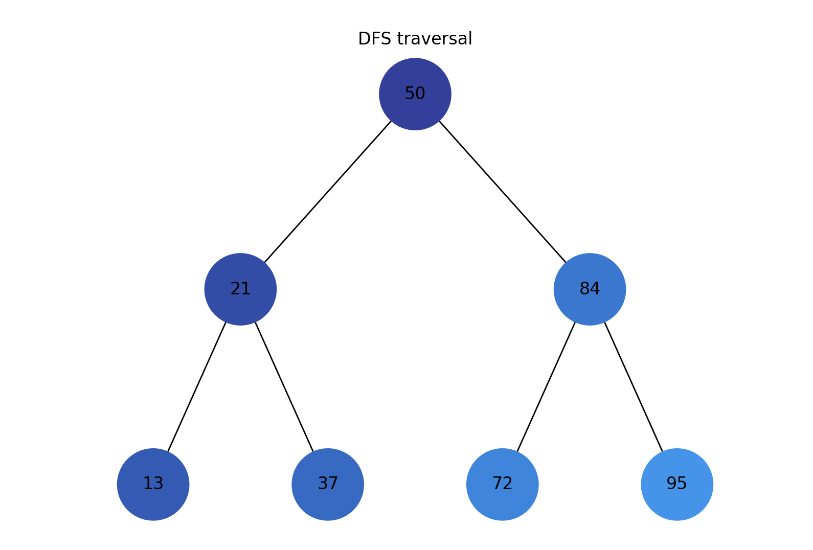
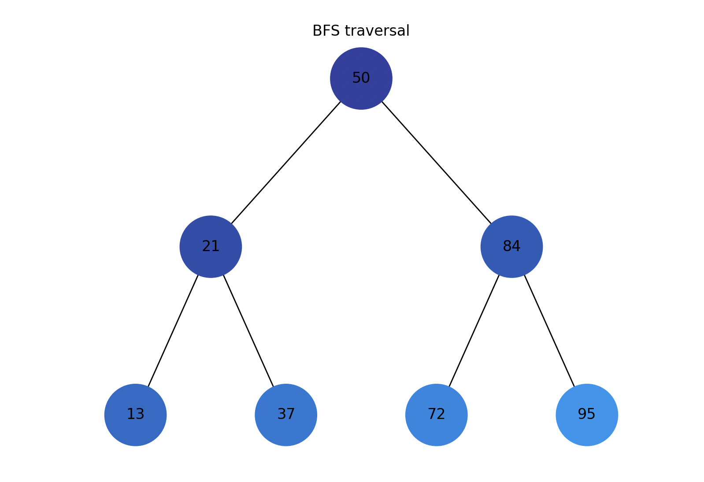
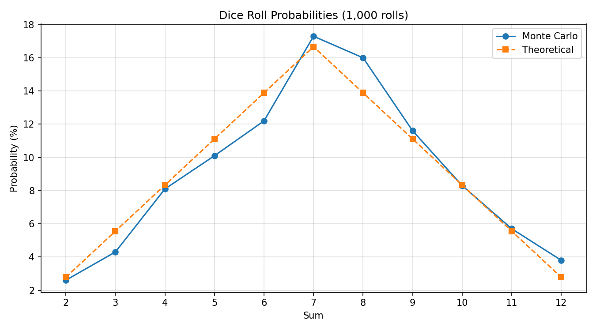
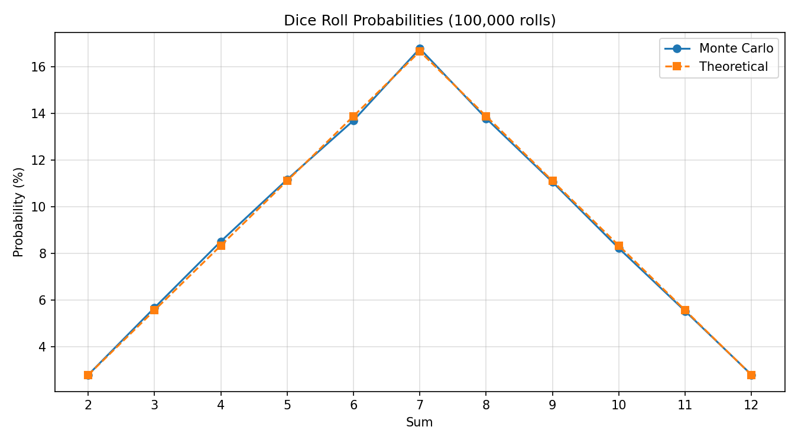
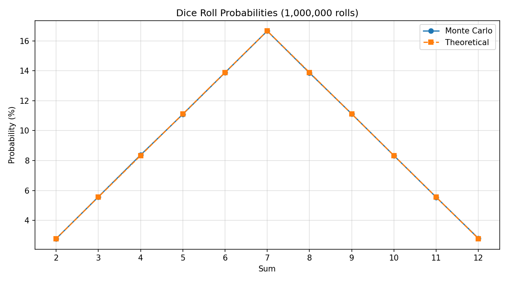

# goit-algo-fp
Algorithms and Data Structures Final Project

## Task 1 (Singly Linked List)
```bash
python task1_linked_list.py  
```

## Task 2 (Pythagoras Tree)
```bash
python task2_pythagoras_tree.py
```
### Result


## Task 3 (Dijkstra algorithm)
Create virtual env and install packages:
```bash
# Windows
.\venv\Scripts\activate

# Mac/Linux
source venv/bin/activate
pip install -r requirements.txt
```
Run command and choose path:
```
python task3_dijkstra_algorithm.py
```

### Result


## Task 4 (Visualise heap tree)
```bash
python task4_heap_visualisation.py
```

### Result


## Task 5 (Visualise tree traversal)
```bash
python task5_tree_traversal.py
```

### Result



## Task 6 (Food selection)
```bash
python task6_food_selection.py 
```

| Algorithm           | Items                            | Calories | Cost |
|---------------------|----------------------------------|----------|------|
| Greedy              | cola, potato, pepsi, hot-dog     | 870      | 80   |
| Dynamic Programming | potato, cola, hot-dog, hamburger | 1020     | 110  |

**Comparison:**

| Aspect           | Greedy          | Dynamic Programming | 
|------------------|-----------------|---------------------|
| Time Complexity  | O(n log n)      | O(n × W)            |
| Space Complexity | O(n)            | O(n × W)            |
| Accuracy         | ~90% of optimal | 100%                |
| Result Quality   | Near-optimal    | Always optimal      |


**Recommended use:**
- **Greedy:** Suitable for large datasets, real-time applications, or when an approximate solution is sufficient.
- **Dynamic Programming:** Best for smaller datasets where the exact optimal solution is required.

## Task 7 (Monte Carlo dice probabilities)
```bash
python task7_dice_probabilities.py
```

After running 100,000 simulations of rolling two dice, the Monte Carlo probabilities closely approximate the theoretical values.
The differences between simulated and theoretical probabilities are very small, mostly under **0.16%**,
which confirms the accuracy of the simulation.

| Sum | Monte Carlo (%) | Theoretical (%) | Difference |
|-----|-----------------|-----------------|------------|
| 2   | 2.85%           | 2.78%           | 0.076      |
| 3   | 5.53%           | 5.56%           | 0.025      |
| 4   | 8.39%           | 8.33%           | 0.060      |
| 5   | 10.95%          | 11.11%          | 0.159      |
| 6   | 13.96%          | 13.89%          | 0.076      |
| 7   | 16.68%          | 16.67%          | 0.014      |
| 8   | 13.88%          | 13.89%          | 0.012      |
| 9   | 11.21%          | 11.11%          | 0.094      |
| 10  | 8.34%           | 8.33%           | 0.008      |
| 11  | 5.52%           | 5.56%           | 0.032      |
| 12  | 2.68%           | 2.78%           | 0.101      |

### Error vs Number of Rolls:
| Simulations | Error  | Time    |
|-------------|--------|---------|
| 100         | ~5%    | instant |
| 1,000       | ~1.5%  | instant |
| 10,000      | ~0.5%  | <1s     |
| 100,000     | ~0.16% | ~1s     |
| 1,000,000   | ~0.05% | ~4s     |

To decrease the error by a factor of 10, approximately 100 times more simulations are required.

### Recommended usage:
- Theoretical: Best for straightforward problems where a precise formula exists, like calculating dice probabilities.
- Monte Carlo: Suitable for complicated problems where an exact analytical solution is difficult or impractical, such as physics simulations, or AI modeling.

### Results




