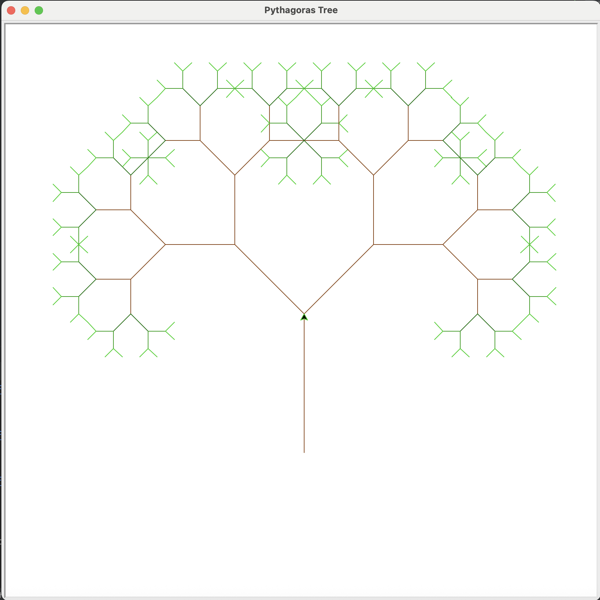
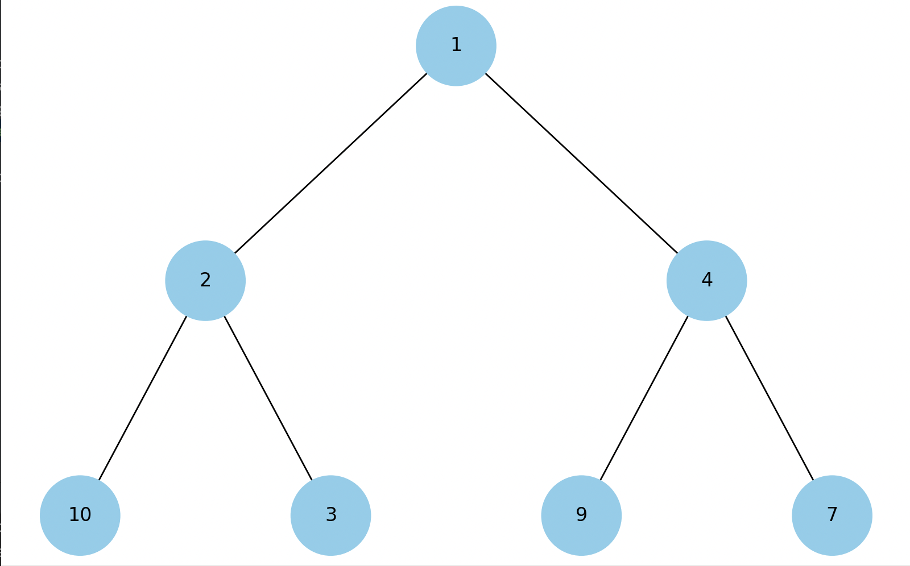

# goit-algo-fp
Algorithms and Data Structures Final Project

## Task 1 (Singly Linked List)
```bash
python task1_linked_list.py  
```

## Task 2 (Pythagoras Tree)
```bash
python task2_pythagoras_tree.py
```
### Result




## Task 3 (Dijkstra algorithm)
Create virtual env and install packages:
```bash
# Windows
.\venv\Scripts\activate

# Mac/Linux
source venv/bin/activate
pip install -r requirements.txt
```
Run command and choose path:
```
python task3_dijkstra_algorithm.py
```

### Result


## Task 4 (Visualise heap tree)
```bash
python task4_heap_visualisation.py
```

### Result
